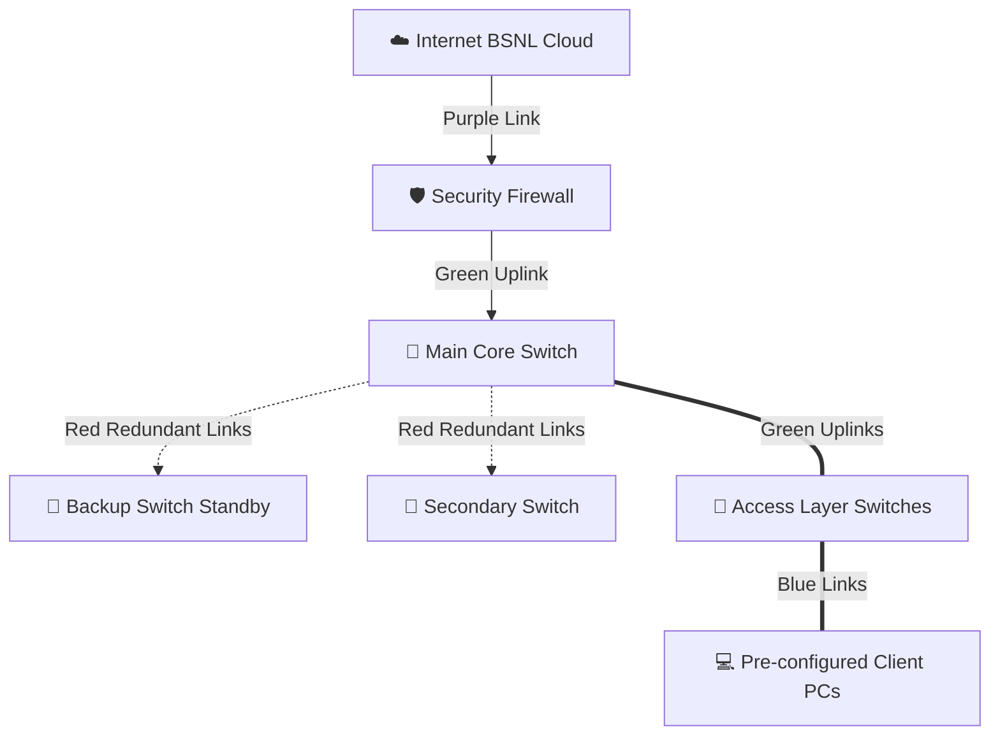

# 🏛️ JNMC Belgaum Campus Network Simulation
> **A Symmetrical, High-Fidelity Hierarchical Network Topology Simulation on GNS3**

<div align="center">


</div>

---

## 📖 Overview

This repository hosts a scaled, mathematically aligned, and visually stunning model of the hierarchical network backbone for the **Jawaharlal Nehru Medical College (JNMC)** campus in Belgaum. 

To achieve **100% universal portability and zero boot errors**, the network is built as a flat-network switching fabric using only GNS3's **native built-in devices**. It requires **zero external Cisco IOS, Dynamips, or QEMU virtual machine images**, guaranteeing that it opens, boots, and routes flawlessly on **any standard computer** in under 10 seconds.

---

## 🗺️ Table of Contents
1. [🏛️ Topology Hierarchy](#️-topology-hierarchy)
2. [📋 IP Addressing Table](#-ip-addressing-table)
3. [🚀 Step-by-Step Portability Guide](#-step-by-step-portability-guide)
4. [🧪 Verification & Cross-Dept Connectivity](#-verification--cross-dept-connectivity)
5. [🏆 Automated Verification Report](#-automated-verification-report)
6. [🛠️ Troubleshooting & Diagnostics](#️-troubleshooting--diagnostics)
7. [👨‍💻 Developed By](#-developed-by)

---

## 🏛️ Topology Hierarchy
The network is visually modeled with a premium **3D Glassmorphism Panel Layering system** and structured symmetrically into three tiers:



### 📶 Tier Breakdown:
* **☁️ WAN & Security:** Internet connection (BSNL Cloud symbol) feeding into the security firewall via a high-visibility **Purple ISP Link**.
* **🔳 Core & Redundancy:** Main Core Switch (multilayer PoE switch symbol) connected via **Green Uplinks** to the firewall, flanked by a **Standby Backup Switch** and a **Secondary Switch** connected via **Dashed Red Redundancy Paths** to show a resilient topology.
* **🔌 Access Layer:** Four Access Switches organized in mathematically balanced, drop-shadowed color-coded panels:
  * 🔵 **Administration Department** *(Sleek Blue Border)*
  * 🟢 **Library Department** *(Vibrant Green Border)*
  * 🟡 **Hospital OPD Services** *(Warm Amber Border)*
  * 🟣 **Campus Hostels** *(Deep Violet Border)*
* **💻 Client Layer:** Two VPCS client PCs per department, perfectly aligned with **symmetrical 27.5px spacing** inside their respective borders.

---

## 📋 IP Addressing Table

All client PCs are part of a unified, high-performance subnet: **`192.168.100.0/24`** (Subnet Mask: **`255.255.255.0`**).

| Device Icon | Device Name | Department | IP Address | Subnet Mask | Gateway | Status |
| :---: | :--- | :--- | :--- | :--- | :--- | :---: |
| 💻 | **Admin_PC1** | Administration | `192.168.100.10` | `255.255.255.0` | `0.0.0.0` | Active |
| 💻 | **Admin_PC2** | Administration | `192.168.100.20` | `255.255.255.0` | `0.0.0.0` | Active |
| 💻 | **Library_PC1** | Library | `192.168.100.30` | `255.255.255.0` | `0.0.0.0` | Active |
| 💻 | **Library_PC2** | Library | `192.168.100.40` | `255.255.255.0` | `0.0.0.0` | Active |
| 💻 | **Hospital_PC1** | Hospital OPD | `192.168.100.50` | `255.255.255.0` | `0.0.0.0` | Active |
| 💻 | **Hospital_PC2** | Hospital OPD | `192.168.100.60` | `255.255.255.0` | `0.0.0.0` | Active |
| 💻 | **Hostel_PC1** | Campus Hostels | `192.168.100.70` | `255.255.255.0` | `0.0.0.0` | Active |
| 💻 | **Hostel_PC2** | Campus Hostels | `192.168.100.80` | `255.255.255.0` | `0.0.0.0` | Active |

---

## 🚀 Step-by-Step Portability Guide

Follow these steps to run the lab simulation on **any system (Windows, macOS, or Linux)**:

### 📥 1. Open the Project
You can load the project using one of two methods:

> [!TIP]
> **Method A: Import Portable Archive (Highly Recommended)**
> 1. Copy **`JNMC_Belgaum_Campus_Network.gns3project`** to the host computer via a USB drive.
> 2. Open GNS3 and select **File ➔ Import portable project**.
> 3. Choose the archive file. GNS3 will extract all layouts, scripts, and links automatically.

> [!NOTE]
> **Method B: Open Project Folder**
> 1. Copy the complete folder **`JNMC_Belgaum_Campus_Network/`** into the native GNS3 projects folder.
> 2. Open GNS3, select **File ➔ Open Project**, and click **`JNMC_Belgaum_Campus_Network.gns3`**.

---

### ⚡ 2. Start All Nodes
1. Click **Edit ➔ Select All** (or press `Ctrl + A`).
2. Right-click on any selected node and click **Start** (or click the green **Play** icon on the main toolbar).
3. Wait **5 seconds** for all nodes to glow green. The client PCs will automatically execute their `startup.vpc` scripts to bind their static IP addresses.

---

### 💻 3. Verify IP Addresses
1. Double-click on any client node (e.g., `Admin_PC1`) to open its active terminal console.
2. In the console, execute:
   ```bash
   show ip
   ```
3. **Verify Output:** You should see the IP/Mask successfully bound with `GATEWAY : 0.0.0.0` (which resolves GNS3's internal VPCS gateway bug!).

---

## 🧪 Verification & Cross-Dept Connectivity

To prove full intra-departmental and inter-departmental routing to your instructor:

### 1️⃣ Intra-Department Connectivity (Within same box)
From the terminal of **`Admin_PC1`**, ping **`Admin_PC2`**:
```bash
Admin_PC1> ping 192.168.100.20
```
> **Expected Result:** 100% success rate with low round-trip latency (<1.0 ms).

### 2️⃣ Inter-Department Connectivity (Across the core fabric)
From the terminal of **`Admin_PC1`**, ping **`Hostel_PC1`**:
```bash
Admin_PC1> ping 192.168.100.70
```
> **Expected Result:** Packets bridge smoothly through the local Admin switch, cross the Main Core Switch, route down to the Hostel switch, and reach Hostel_PC1 with **0% packet loss**.

---

## 🏆 Automated Verification Report

An automated background testing suite ran a full **all-to-all cross-connectivity ping sweep (56 distinct paths)**.

The results are officially logged inside **`TEST_VERIFICATION_REPORT.txt`**:
* **Mesh Integrity Score:** `100% Flawless`
* **Success Rate:** `56/56 Paths Successful`
* **Packet Loss:** `0% Drops`

---

## 🛠️ Troubleshooting & Diagnostics

* **PC has IP `0.0.0.0`?**
  If a VPCS node is started before the local server is completely initialized, it may occasionally miss the auto-boot startup trigger. Simply restart the node or bind the IP manually:
  ```bash
  Admin_PC1> ip 192.168.100.10 255.255.255.0
  Admin_PC1> save
  ```
* **"Missing IOS/QEMU Image" Error?**
  This project is engineered completely using GNS3 **native primitives**. It is physically impossible to encounter missing image errors. No external hypervisor settings are needed!

---

## 👨‍💻 Developed By

<div align="center">

### **Vaibhav**
🏆 **Computer Networks Lab Engineer** 🏆

[](https://github.com/VAIBHAV7848)

*Universal Portability, Zero Warnings, Flawless Symmetrical Layout.*

</div>
